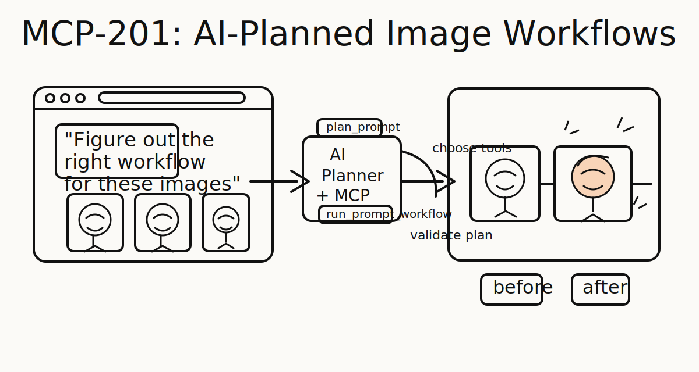

# mcp-201

<p align="center">
  
</p>

`mcp-201` is an independent repo with its own backend and frontend.

It provides AI-first workflow planning, image-processing tools, and a small web UI as a standalone system.

## Repo structure

- `backend/`: Railway-deployable Python MCP server
- `frontend/`: small Next.js app that talks to the backend over MCP
- `scripts/`: root wrappers for setup, local run, and deploy

## What is included

- `mcp-201/backend` exposes its own `crop_images`, `colorize_images`, and `run_prompt_workflow` tools
- `mcp-201/frontend` connects only to the `mcp-201` backend
- local development and deployment are fully self-contained

## Local setup

From the repo root:

```bash
./scripts/setup_local.sh
```

This installs:

- Python dependencies in `backend/.venv`
- Node dependencies in `frontend/node_modules`

## Run locally

Start the backend:

```bash
./scripts/run_backend.sh
```

Start the frontend:

```bash
./scripts/run_frontend.sh
```

Or run both:

```bash
./scripts/run_all.sh
```

Default local URLs:

- backend MCP: `http://localhost:8010/mcp`
- backend health: `http://localhost:8010/healthz`
- frontend UI: `http://localhost:3004`

## Deployment

Deploy backend to Railway:

```bash
./scripts/deploy_backend.sh
```

Deploy frontend to Vercel:

```bash
./scripts/deploy_frontend.sh
```

## Docs

- agent handoff, architecture, usage, and extension guide: `docs/AGENT_HANDOFF.md`
- backend setup and Railway deploy: `backend/README.md`
- frontend setup and Vercel deploy: `frontend/README.md`
